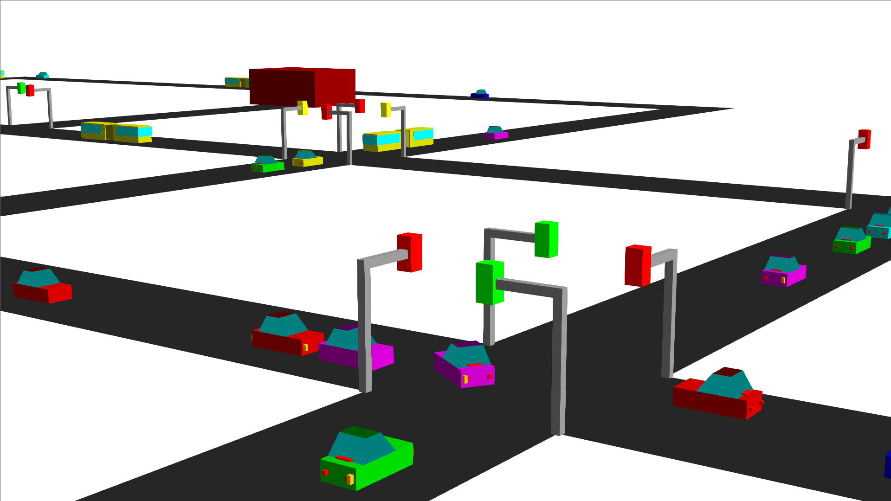
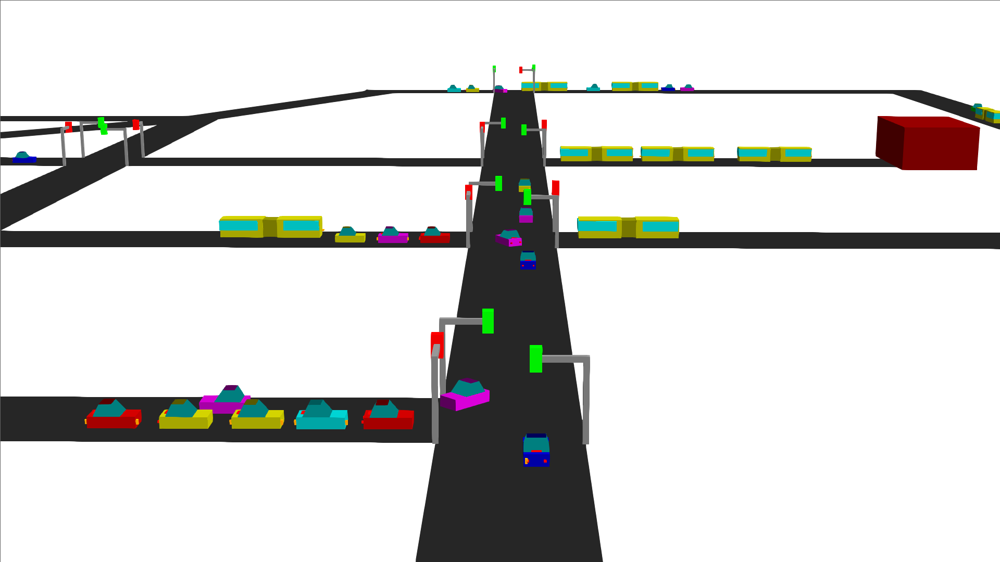

# City traffic simulation
A project I created for OOP subject at Warsaw University of Technology. I used C++ and OpenGL.
The program loads all objects defined by user from external text files. After launching simulation, the program creates a new window and renders a map. During runtime user can move the camera and control time scaling.
Simulator uses OpenGL to render graphics and depending on OS it uses WinAPI or X11 to handle UI.

[Link to Youtube video](https://youtu.be/NdPUuOY7QYQ)

## Requirements
This program should work on Windows and Linux machines (Linux must support X11). 
## Building
I included an old Makefile which works on my Ubuntu 16.04 and creates a debug version of this project. On Windows side I used a Code::Blocks project. Use C++11 (-std=c++11) on both operating systems. Remember to define a _WIN32 symbol (-D_WIN32) when building on Windows.
## Road structure
 Structure of the map is similar to a graph - intersections are vertices and streets connect them like edges. There are also garages which produce new vehicles (cars or buses). Garages are connected directly with intersections. There are two types of intersections – with and without lights.

## Loading data
Program should load two files created by user before starting a simulation – one for defining road objects and the second for defining right of way at intersections. Example files are included in this repo.

# Loading objects
This file contains information about all objects (without vehicles) which exist in the simulation. Each line of text defines a single object (empty lines are allowed). The first word of the line tells a type of the creating object and the second is its name in the program. Each name must be unique. This file is being loaded by method loadRoad(file_name). Capitalizations of type does not matter.

1st param – type of object

2nd param – unique name

## Creating intersection
1st param – type – CR or CROSS or IN or INTERSECTION

2nd param – name

3rd, 4th, 5th param – position in 3D (x, y, z, where y is vertical)

Example: CR S1 -2 0 2
## Creating intersections with lights
1st param – type – CL or CROSSLIGHTS or IL or INTERSECTIONLIGHTS 

Other parameters are the same as in intersections.

Example: CL L1 -6 0 -6
## Creating street
1st param– type – ST or STREET

2nd param – name

3rd, 4th param – names of intersections, which will be connected by this street (in sequence: beginning and end)

Example: ST D1 S1 S2
## Creating garage
1st param – type – GA or GARAGE

2nd param – name

3rd param – type of created objects:

	C or CAR for cars

	B or BUS for buses

4th param – name of the intersection which will be connected with this garage

5th, 6th, 7th param – position in 3D (x, y, z, where y is vertical)

8th param – time in seconds – how often a new vehicle will be created

9th param – max number of vehicles created by this garage that could exist on map (added because too big number of vehicles could block the whole map – everyone can’t make a turn due to lack of free space)

Example: GA G1 C S1 -2 0 4 5 25
## Attention:
When creating a new object referring to another object, this second object must be defined before the first one. Suggested (but not required) order of defining objects: intersections and then streets and garages.

# Loading right of way
This file should contain right of way for each intersection. If there is no right of way for certain intersections, it will set randomly. Each line of text is a single right of way (empty lines are allowed). A file is being loaded by method loadRightOfWay(file_name). Given streets of certain intersection must be in a counterclockwise order. When defining intersection with 3 streets, start with street which is “stem of T”.
## Defining a single right of way
1st param – name of intersection
2nd param – number of streets at this intersection 
Next parameters – names of streets (including garages) in counterclockwise order

In case of any errors while reding a file or loading an object, the Objectsloader will throw an appropriate exception and will display a message in standard output.

# Copyright
Copyright © Robert Dudziñski 2018

